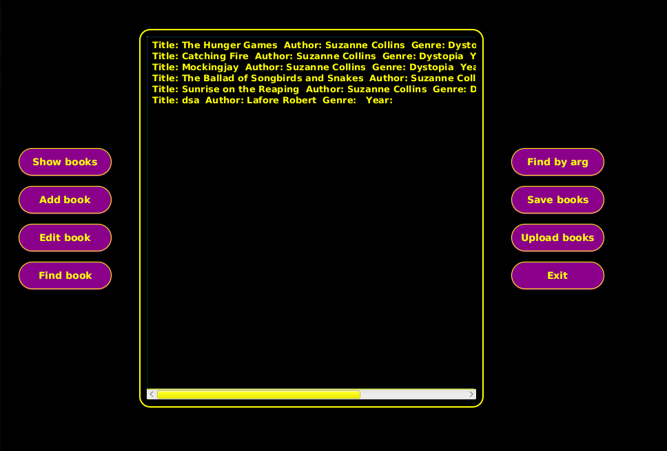
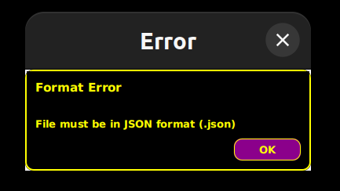

## Описание проекта

Менеджер библиотеки на JavaFX, в котором пользователи могут добавлять, изменять и удалять книги, а также загружать и выгружать список книг из файлов в JSON.

Цель данного пет-проекта - применение знаний о Java Core на практике: 
* Maven
* Работа с ООП
* Java Collections Framework
* Input/Output (files)
* Lombok

